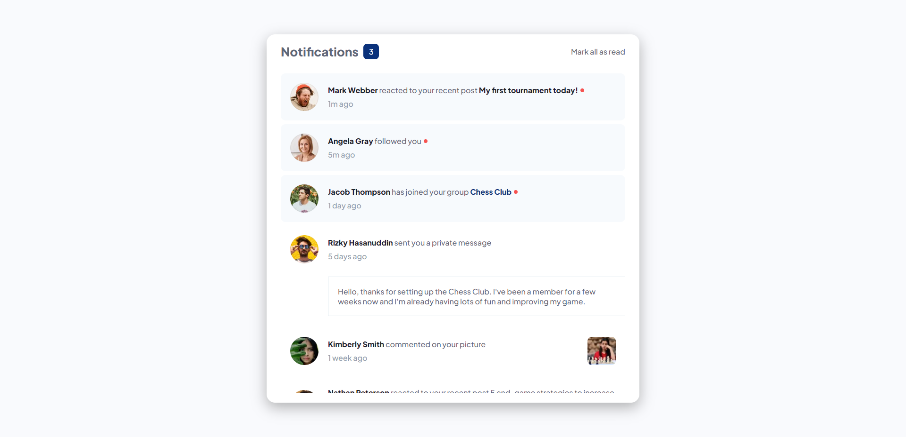
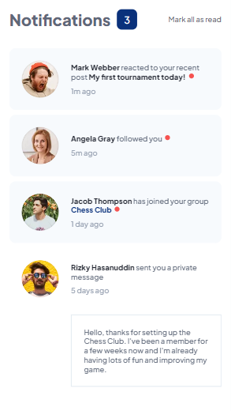

# Frontend Mentor - Notifications page solution

This is a solution to the [Notifications page challenge on Frontend Mentor](https://www.frontendmentor.io/challenges/notifications-page-DqK5QAmKbC). Frontend Mentor challenges help you improve your coding skills by building realistic projects.

## Table of contents

- [Overview](#overview)
  - [The challenge](#the-challenge)
  - [Screenshot](#screenshot)
  - [Links](#links)
- [My process](#my-process)
  - [Built with](#built-with)
  - [What I learned](#what-i-learned)
  - [Continued development](#continued-development)
  - [Useful resources](#useful-resources)
- [Author](#author)
- [Acknowledgments](#acknowledgments)

## Overview

### The challenge

Users should be able to:

- Distinguish between "unread" and "read" notifications
- Select "Mark all as read" to toggle the visual state of the unread notifications and set the number of unread messages to zero
- View the optimal layout for the interface depending on their device's screen size
- See hover and focus states for all interactive elements on the page

### Screenshots

]
]

### Links

- [Live Site](https://notifications-page-alpha.vercel.app/)

## My process

### Built with

- Semantic HTML5 markup
- CSS custom properties
- Vanilla Javascript
- Flexbox

### What I learned

I got to play around with Javascript, which I always enjoy. Something fun to learn about CSS was the :after pseudo class. I've used it before, but not often.

The biggest thing I learned was how to hide the scrollbar, since I couldn't get all of my content to fit in the card in the same way they show in the screenshot. Instead, I had to make the content of the card scroll. But I wanted to keep the Notifications header and "Mark all as read" button visible even while the rest of the content scrolled, so I had to play around with overflow properties on different divs.

### Continued development

If I were to continue working on this app, I'd want to include an option to mark a read notification as unread.

## Author

- Website - [HeyTylerMartin.com](https://heytylermartin.com)
- Frontend Mentor - [@HeyTylerMartin](https://www.frontendmentor.io/profile/heytylermartin)
- Twitter - [@HeyTylerMartin](https://www.twitter.com/heytylermartin)

